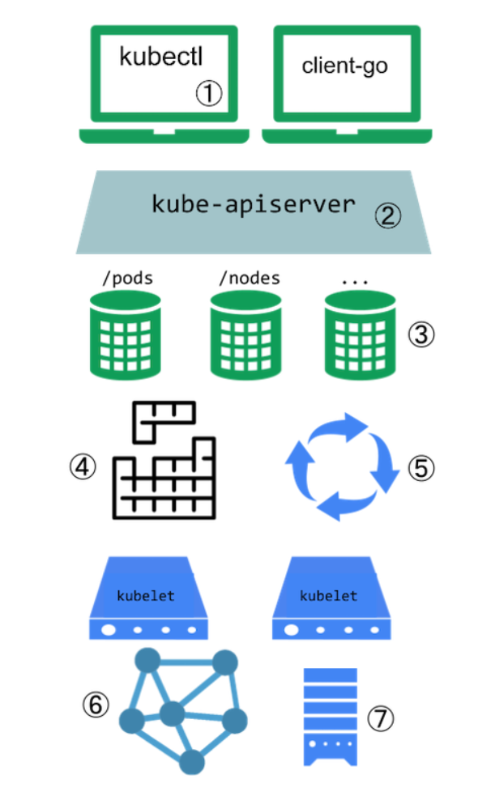

# 扩展 Kubernetes 示例

reference：

https://kubernetes.io/zh-cn/docs/concepts/extend-kubernetes/

Kubernetes 系统中的扩展点：

1. 用户通常使用 kubectl 与 Kubernetes API 交互。 kubectl 插件能够扩展 kubectl 程序的行为。 这些插件只会影响到每个用户的本地环境，因此无法用来强制实施整个站点范围的策略。

2. API 服务器处理所有请求。API 服务器中的几种扩展点能够使用户对请求执行身份认证、 基于其内容阻止请求、编辑请求内容、处理删除操作等等。 这些扩展点在 API 访问扩展节详述。

3. API 服务器向外提供不同类型的资源（resources）。 内置的资源类型，如 pods，是由 Kubernetes 项目所定义的，无法改变。 你也可以添加自己定义的或者其他项目所定义的称作自定义资源（Custom Resources） 的资源，正如自定义资源节所描述的那样。 自定义资源通常与 API 访问扩展点结合使用。

4. Kubernetes 调度器负责决定 Pod 要放置到哪些节点上执行。 有几种方式来扩展调度行为。这些方法将在 调度器扩展节中展开。

5. Kubernetes 中的很多行为都是通过称为控制器（Controllers）的程序来实现的， 这些程序也都是 API 服务器的客户端。控制器常常与自定义资源结合使用。

6. 组件 kubelet 运行在各个节点上，帮助 Pod 展现为虚拟的服务器并在集群网络中拥有自己的 IP。 网络插件使得 Kubernetes 能够采用不同实现技术来连接 Pod 网络。

7. 组件 kubelet 也会为容器增加或解除存储卷的挂载。 通过存储插件，可以支持新的存储类型。
